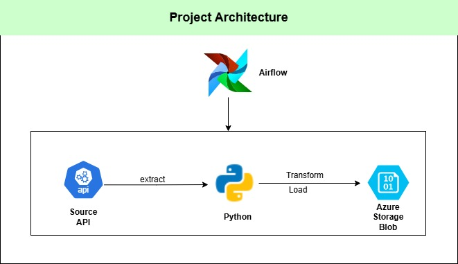
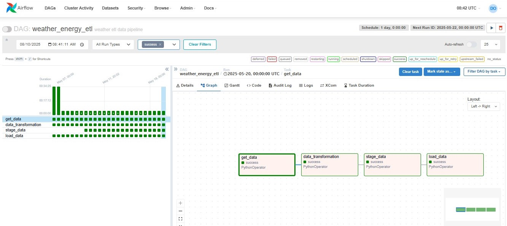

# Weather Data ETL for Energy Analytics

This ETL project extracts weather data for energy analytics, leveraging on Apache Airflow, Python, and Azure Cloud technologies. 
It retrieves data from a weather API, transforms the data for analytical use, and loads the processed data into Azure Cloud. 
The pipeline ensures efficient, scalable and reliable data processing to support energy-related insights.

## Business Problem

Grean Power Limited is a leading renewable energy provider in Abuja, Nigeria, operates a network of solar and wind mini-grid power stations. 
To enhance operational efficiency and optimize energy distribution through proactive load management, the company requires a unified and readily accessible data of critical atmospheric metrics. 
This necessitates a solution to reliably collect and integrate data on wind speed, temperature, sunrise, sunset, and other relevant metrics from disparate sources. 

## Challenges

The company operates a Hybrid Cloud system and required to maintain the existing infrastructure in storing and managing thier data.
This demands that every transformed data must be merged with existing on_prem dataset before loading into the data lake

## Architecture

## Workflow
1. Data is extracted from a reliable source: https://openweathermap.org/
2. The extracted data is transformed.
3. Transformed data is merged with on-prem existing data.
4. Data is loaded to Azure Storage Blob, which is the company's scalable cloud storage repository.

## Technology Used
1. Python
2. Airflow
3. Azure Cloud
   - Storage blob Gen2

## API Used
The API used for this project is https://openweathermap.org/

## Scripts
The  script contains the airflow dag and python functions used for extraction, transformation, staging and loading data.
All  the functions are connected with the dag by thier task ID's and data is exchanged using Xcoms

##  Result

